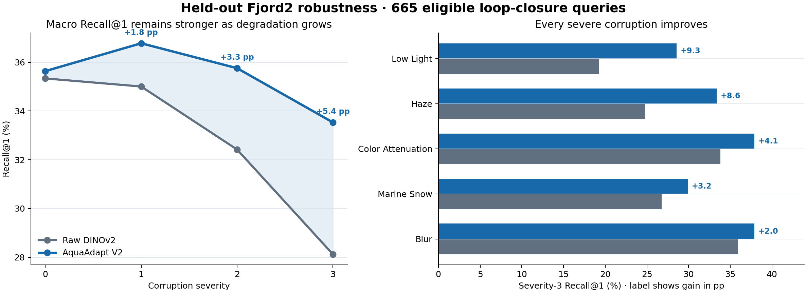
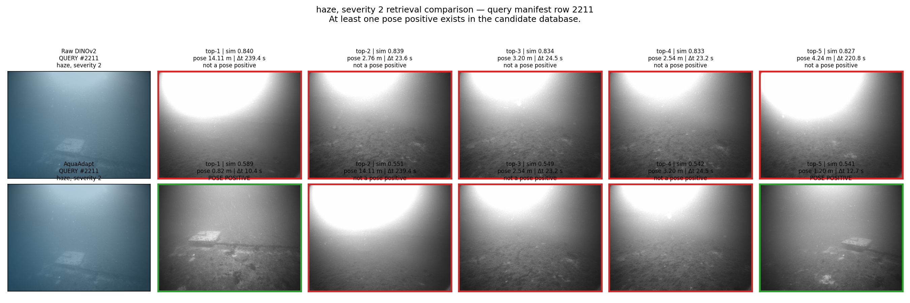
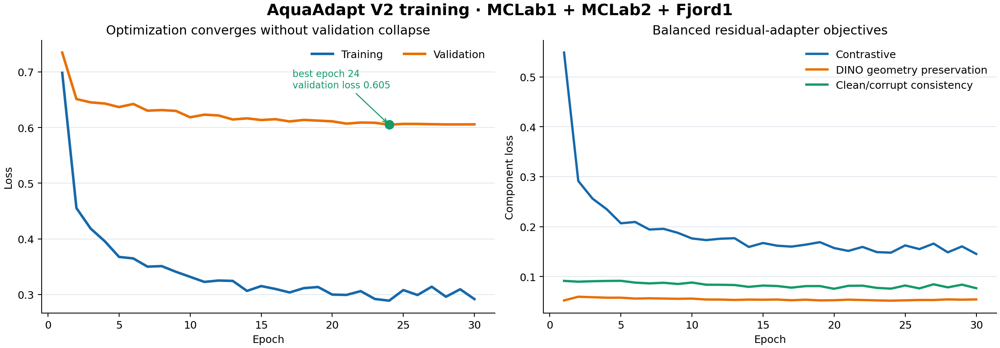

<div align="center">

# AquaAdapt

### Self-supervised DINOv2 adaptation for robust underwater place recognition

**Real ROS1 imagery · pose-based ground truth · held-out trajectory evaluation**

[Results](#held-out-fjord2-results) ·
[Visual comparison](#qualitative-retrievals) ·
[Training](#training-behavior) ·
[Reproduction](#reproduce-the-final-experiment) ·
[Limitations](#scope-and-limitations)

</div>

<p align="center">
  
</p>

> **Final protocol:** train the residual AquaAdapt V2 adapter on **MCLab1 +
> MCLab2 + Fjord1**, freeze the checkpoint, and evaluate on **Fjord2**, which is
> never used for training, validation, or model selection.
>
> **Main result:** AquaAdapt preserves clean DINOv2 retrieval and improves
> Recall@1 for every tested corruption at every nonzero severity on held-out
> Fjord2. The improvement grows from **+1.8 pp** at severity 1 to **+5.4 pp** at
> severity 3.

## What AquaAdapt does

AquaAdapt converts an underwater RGB frame into a normalized place descriptor
for cosine-similarity retrieval. The system:

1. extracts a visible camera stream from ROS1 bags at 5 Hz;
2. associates each frame with the nearest TUM reference pose;
3. obtains a frozen 384-D DINOv2 ViT-S/14 CLS descriptor;
4. learns a zero-initialized residual correction from controlled underwater
   degradations; and
5. evaluates retrieval with geometric positives, temporal exclusion, coverage,
   Recall@K, MRR, and translation error.

For normalized DINOv2 feature \(x\), V2 computes

\[
z = \operatorname{normalize}\left(x + 0.25 f_\theta(x)\right),
\]

where \(f_\theta\) is a `384 → 512 → 384` residual adapter. Zero initialization
makes the initial descriptor identical to raw DINOv2. Training combines
multi-positive InfoNCE, DINO similarity-geometry preservation, and clean/corrupt
consistency.

## Held-out Fjord2 results

The database contains 1,096 clean reference frames. Of 1,095 candidate queries,
665 have at least one valid revisit after the 10-second exclusion window,
giving **60.73% evaluation coverage**. Metrics below use only those eligible
queries.

| Method | Recall@1 | Recall@5 | Recall@10 | MRR | Median top-1 error |
|---|---:|---:|---:|---:|---:|
| Raw DINOv2 | 35.34% | 49.32% | 56.24% | 42.34% | 2.63 m |
| **AquaAdapt V2** | **35.64%** | **51.13%** | **57.44%** | **42.59%** | **2.48 m** |
| Change | **+0.30 pp** | **+1.80 pp** | **+1.20 pp** | **+0.25 pp** | **−0.15 m** |

The clean Recall@1 improvement is deliberately described as modest. The
stronger result is consistent robustness under domain-relevant degradation.

<p align="center">
  
</p>

| Severity | Raw DINOv2 Recall@1 | AquaAdapt Recall@1 | Change |
|---:|---:|---:|---:|
| Clean | 35.34% | **35.64%** | **+0.30 pp** |
| 1 | 35.01% | **36.78%** | **+1.77 pp** |
| 2 | 32.42% | **35.76%** | **+3.34 pp** |
| 3 | 28.12% | **33.53%** | **+5.41 pp** |

At severity 3, AquaAdapt improves Recall@1 by **+9.32 pp** in low light,
**+8.57 pp** under haze, **+4.06 pp** under color attenuation, **+3.16 pp**
under marine snow, and **+1.95 pp** under blur.

Machine-readable tables are available in
[`docs/results/`](docs/results/).

## Qualitative retrievals

The panel below is generated from a real held-out Fjord2 query under
severity-2 haze. Raw DINOv2 selects a frame **14.11 m** away; AquaAdapt returns
a pose-positive match **0.82 m** away. Green borders indicate matches inside the
1.5 m positive radius; red borders indicate incorrect retrievals.

<p align="center">
  <a href="docs/assets/fjord2_retrieval_highlights.mp4">
    
  </a>
</p>

<p align="center">
  <strong>
    <a href="docs/assets/fjord2_retrieval_highlights.mp4">
      ▶ Watch the 32-second held-out retrieval highlight video
    </a>
  </strong>
</p>

The video cycles through genuine haze, low-light, color-attenuation, and
marine-snow comparisons. The full gallery and long playback are generated
locally rather than committed to Git.

## Training behavior

The final residual adapter trains for 30 epochs with a frozen DINOv2 backbone.
The selected checkpoint is epoch **24**, with validation loss **0.6052**.
Balanced trajectory sampling prevents the longest trajectory from dominating
optimization.

<p align="center">
  
</p>

Training uses:

- one clean anchor and at most one corrupted view per sample;
- low light, color attenuation, haze/backscatter, blur, and marine snow;
- temporal and pose-near positives from the same trajectory only;
- no positive mining across unrelated trajectory coordinate systems;
- a frozen DINOv2 ViT-S/14 backbone; and
- early-stopping checkpoint selection using training-domain validation only.

## Installation

Python 3.10 or newer is required.

```bash
python3 -m venv .venv
source .venv/bin/activate
python3 -m pip install --upgrade pip
python3 -m pip install -e ".[dev]"

# Optional exact FAISS search; NumPy is the automatic fallback.
python3 -m pip install -e ".[faiss]"

pytest -q
aquaadapt --help
```

DINOv2 is loaded from the official `facebookresearch/dinov2` PyTorch Hub
repository. The first run requires network access unless the model is already
cached.

## Dataset

The experiments use the
[`ntnu-arl/underwater-datasets`](https://huggingface.co/datasets/ntnu-arl/underwater-datasets)
ROS1 bags and baseline TUM trajectories.

```bash
hf download ntnu-arl/underwater-datasets \
  --repo-type dataset \
  --include "subset-mclab/mclab_1/*" \
  --include "subset-mclab/mclab_2/*" \
  --include "subset-fjord/fjord_1/*" \
  --include "subset-fjord/fjord_2/*" \
  --local-dir /path/to/ntnu_underwater
```

Update the `paths` section of the selected YAML configuration to match the
local dataset and DINOv2 cache locations. Bags, extracted frames, descriptor
caches, and checkpoints are intentionally excluded from Git.

See [`docs/dataset.md`](docs/dataset.md) for the frame/pose association and
manifest policy.

## Reproduce the final experiment

The master runner lists every registered training/evaluation combination:

```bash
bash scripts/run_experiment_matrix.sh --list
```

Preview the final workflow without running anything:

```bash
bash scripts/run_experiment_matrix.sh --recommended --dry-run
```

After the MCLab1, MCLab2, and Fjord1 source manifests have been prepared, run
the final training and held-out Fjord2 evaluation:

```bash
bash scripts/run_experiment_matrix.sh \
  --recommended \
  --skip-completed
```

The explicit commands are:

```bash
bash scripts/run_mclab12_fjord1_train_v2.sh
bash scripts/run_fjord2_heldout_from_mclab12_fjord1_v2.sh
```

Generated outputs are written under `artifacts/` and `results/`; both
directories are ignored by Git. Rebuild the public README figures from the
curated CSVs with:

```bash
python3 scripts/generate_readme_figures.py
AQUAADAPT_DATA_ROOT=/path/to/ntnu_underwater \
  python3 scripts/generate_architecture_figure.py
```

## Repository structure

```text
aquaadapt/
  bag/              ROS1 inspection, decoding, extraction
  trajectory/       TUM parsing and timestamp association
  data/             manifests, guarded splits, positive sampling
  augmentations/    controlled underwater degradations
  models/           DINOv2 wrapper and residual adapter
  losses/           multi-positive InfoNCE
  training/         optimization, checkpointing, reproducibility
  retrieval/        descriptor caches and cosine search
  evaluation/       pose metrics, robustness, ablations, efficiency
  visualization/    retrieval panels, maps, videos, plots
configs/            reproducible experiment configurations
scripts/            training, evaluation, matrix runner, figure generation
tests/              synthetic unit and integration tests
docs/               protocol, limitations, curated figures and result tables
```

## Scope and limitations

- This is visual place recognition, not SLAM, odometry, navigation, depth
  estimation, segmentation, or sonar fusion.
- Fjord2 is an unseen **trajectory**, but Fjord1 is present during training;
  this supports held-out-trajectory robustness, not a claim of universal unseen
  underwater-environment generalization.
- Only 665 of 1,095 Fjord2 candidate queries have a valid revisit after
  temporal exclusion. Coverage is reported rather than fabricating positives.
- Controlled corruptions are robustness probes, not a complete physical model
  of underwater image formation.
- Clean Recall@1 improves by only 0.30 percentage points. The strongest evidence
  is the consistent corruption result, not broad clean-domain dominance.

More detail is provided in
[`docs/evaluation_protocol.md`](docs/evaluation_protocol.md) and
[`docs/limitations.md`](docs/limitations.md).


```

Released under the [MIT License](LICENSE).
