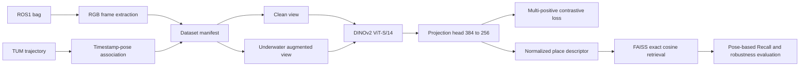

# AquaAdapt

**Self-Supervised Adaptation of DINOv2 for Robust Underwater Place Recognition**

AquaAdapt is a reproducible research pipeline for extracting an RGB stream from an NTNU
ROS1 bag, associating images with a TUM reference trajectory, adapting DINOv2 ViT-S/14
with controlled underwater degradations, and evaluating place retrieval with pose-based
ground truth. It intentionally addresses visual place recognition only—not SLAM, visual
odometry, sonar fusion, depth, segmentation, or navigation.



## Installation

Python 3.10 or newer is required. DINOv2 is loaded only from the official
`facebookresearch/dinov2` PyTorch Hub repository; no larger DINOv2 model or learned image
enhancer is downloaded.

```bash
python3 -m pip install -e .
aquaadapt --help
pytest -q
```

FAISS is optional. When it cannot be imported, AquaAdapt logs a warning and performs the
same exact normalized inner-product search with NumPy.

## Configured data paths

The checked-in configs use:

```text
bag:          /mnt/windows/datasets/ntnu_underwater/subset-mclab/mclab_1/mclab_1.bag
trajectory:   /mnt/windows/datasets/ntnu_underwater/subset-mclab/mclab_1/mclab_1_baseline.tum
calibration:  /mnt/windows/datasets/ntnu_underwater/calibrations
processed:    /mnt/windows/datasets/ntnu_underwater/processed
TORCH_HOME:   /mnt/windows/datasets/model_cache/torch
```

Original bag and TUM inputs are opened read-only. Extracted images, manifests, descriptor
caches, and large checkpoints go under `processed`; source code and reports remain here.
Calibration files are inventoried by `doctor` but raw image rectification is not required
for the initial experiment.

## Quick start

Run the complete bounded smoke pipeline:

```bash
bash scripts/run_quick_pipeline.sh
```

It checks the environment, inspects all bag connections, auto-selects a real RGB topic,
extracts at most 300 frames at 1 Hz, associates poses, creates guarded chronological
splits, visualizes corruptions, validates DINOv2, evaluates the raw baseline, trains one
short projection-head epoch, evaluates AquaAdapt, runs reduced robustness, and writes a
report.

Individual stages are inspectable:

```bash
aquaadapt doctor --config configs/mclab1.yaml
aquaadapt inspect-bag --config configs/mclab1.yaml
aquaadapt extract --config configs/quick.yaml --quick
aquaadapt parse-trajectory --config configs/quick.yaml
aquaadapt build-manifest --config configs/quick.yaml
aquaadapt visualize-augmentations --config configs/quick.yaml
aquaadapt check-backbone --config configs/quick.yaml
aquaadapt baseline --config configs/quick.yaml --method raw_dinov2
aquaadapt train --config configs/quick.yaml --mode projection_head_only --quick
aquaadapt visualize-retrievals --config configs/quick.yaml \
  --checkpoint /mnt/windows/datasets/ntnu_underwater/processed/checkpoints/mclab1_quick/projection_head_only/best.pt \
  --quick
```

The retrieval visualizer writes an HTML gallery and PNG panels under
`results/mclab1_quick/qualitative/`. Each panel compares raw DINOv2 and AquaAdapt top-5
retrievals on the actual test images, with similarity, pose distance, time separation,
and red/green pose-ground-truth borders. It also renders all five severity-controlled
corruptions, a query/database similarity heatmap, and a trajectory map of top-1 links.
The same directory includes `retrieval_comparison.mp4`, which plays the test queries next
to the raw-DINOv2 and AquaAdapt top-1 retrievals.

Run the complete experiment only when adequate compute and time are available:

```bash
bash scripts/run_full_pipeline.sh
```

## Extraction and manifests

`rosbags.highlevel.AnyReader` reads ROS1 bags without a ROS master. Inspection lists every
topic, message type, count, timestamps, approximate frequency, and decoded image
properties. Topic selection rejects depth, disparity, masks, segmentation, and thermal
streams, then favors a valid, high-count visible image stream. Override it with
`extraction.camera_topic` or `inspect-bag --camera-topic`.

Raw and compressed images are supported. Raw decoding respects `step`, padded rows, and
endianness and handles BGR/RGB/mono/alpha/Bayer plus 16-bit and float single-channel
inputs. Extraction samples by nanosecond bag time, is resumable, writes JPEGs named by
timestamp, and atomically updates metadata. Pose association uses sorted binary search,
not a quadratic scan. Timestamp offsets are configuration values and are never silently
invented.

The one-trajectory policy uses contiguous 60% train, 2% guard, 18% validation, 2% guard,
and 18% test blocks. `trajectory_id` is retained in every row, and the split module also
supports whole-trajectory assignments for future `mclab_2` experiments.

## Training and evaluation

The raw baseline is a normalized 384-D DINOv2 CLS descriptor. The classical comparison
uses gray-world white balance, luminance CLAHE, and mild gamma correction before the same
backbone. AquaAdapt learns a normalized 256-D projection using paired underwater-augmented
views and in-batch negatives. The default backbone is frozen; the final one or two
transformer blocks can be unfrozen with a separate learning rate.

Evaluation builds interleaved query/database subsets from the test block, excludes the
same frame and all database samples within the configured temporal window, and calls a
retrieval correct only inside the configured translation radius. Queries with no valid
post-exclusion positive are **ineligible**, excluded from Recall/MRR, and reported in
coverage. The default protocol never substitutes timestamp proximity for place truth.

Robustness uses a clean database and deterministically corrupted queries at severity
0–3 for low light, channel attenuation, haze/backscatter, blur, and marine snow. Outputs
include machine-readable CSV files and standard matplotlib plots.

## Repository map

```text
aquaadapt/bag/            bag inventory, decoding, extraction
aquaadapt/trajectory/     TUM parsing, geometry, timestamp association
aquaadapt/data/           manifests, guarded splits, transforms, datasets
aquaadapt/augmentations/  deterministic severity and stochastic training views
aquaadapt/models/         official DINOv2 wrapper and projection head
aquaadapt/losses/         stable multi-positive InfoNCE
aquaadapt/training/       AMP training, schedules, checkpoints, logs
aquaadapt/retrieval/      descriptor caches, FAISS/NumPy exact cosine search
aquaadapt/evaluation/     pose protocol, robustness, ablations, efficiency
aquaadapt/visualization/  trajectory, augmentation, training, retrieval figures
configs/                  dataset, quick, and full YAML configurations
scripts/                  turnkey quick/full workflows and optional ROS fallback
tests/                    synthetic unit and integration-level tests
docs/                     protocol and design details
```

## Results and reporting

`aquaadapt report` reads completed artifacts and writes `results/<run>/report.md`,
`summary.json`, and result CSVs. It never inserts synthetic metric values; unavailable
ablation measurements are `NA`. Generated tables may be copied into this README after a
completed run.

## Limitations and extension

These results are a single-trajectory development evaluation and do not establish
cross-trajectory or cross-environment generalization. A trajectory without sufficient
revisits can have low eligible-query coverage; AquaAdapt reports that rather than
fabricating loop closures. A defensible final study should add `mclab_2` or another
repeated trajectory and use whole-trajectory splits. The degradations are controlled
robustness probes, not a full physical underwater renderer.


Released under the MIT License. See [LICENSE](LICENSE).
