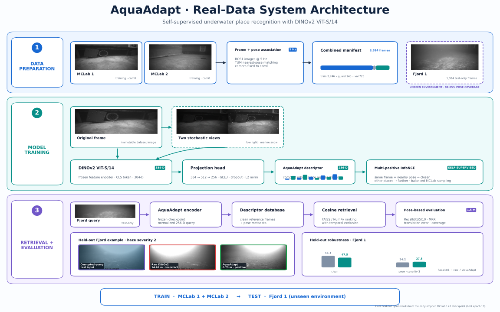

# Architecture and objective

AquaAdapt maps a visible underwater frame to a normalized vector for exact cosine place
retrieval. The official DINOv2 ViT-S/14 backbone supplies a normalized 384-dimensional
CLS descriptor \(x\). The final V2 model learns only a residual correction:

\[
z = \operatorname{normalize}\left(x + \alpha f_\theta(x)\right),
\qquad \alpha = 0.25,
\]

where

```text
fθ: Linear(384, 512) → GELU → Linear(512, 384)
```

The final linear layer is initialized to zero, so the initial AquaAdapt descriptor is
exactly raw normalized DINOv2. Adaptation therefore begins from the foundation descriptor
instead of replacing it with a random projection. The DINOv2 backbone remains frozen in
the final experiment.



## Training objectives

Training uses one clean anchor and at most one controlled corrupted view. The optimized
objective combines:

1. multi-positive InfoNCE for place discrimination;
2. pairwise-similarity preservation to retain clean DINOv2 geometry; and
3. clean/corrupt consistency for degradation robustness.

Let normalized descriptors be \(z_i\), cosine similarity \(s_{ij}=z_i^\top z_j\),
temperature \(\tau\), and valid positive indices \(P(i)\). The contrastive component is:

\[
\mathcal{L}_i =
-\log \frac{\sum_{p \in P(i)} \exp(s_{ip}/\tau)}
{\sum_{a \ne i} \exp(s_{ia}/\tau)}.
\]

Self-similarity is removed. Anchors without positives are omitted, and the implementation
uses `logsumexp` for numerical stability. Temporal and geometric positives must come from
the same trajectory and satisfy configured time and pose-distance gates.

## Final protocol

The final checkpoint uses balanced sampling from MCLab1, MCLab2, and Fjord1. Checkpoint
selection uses validation portions of those training trajectories only. Fjord2 remains
completely held out until evaluation.
